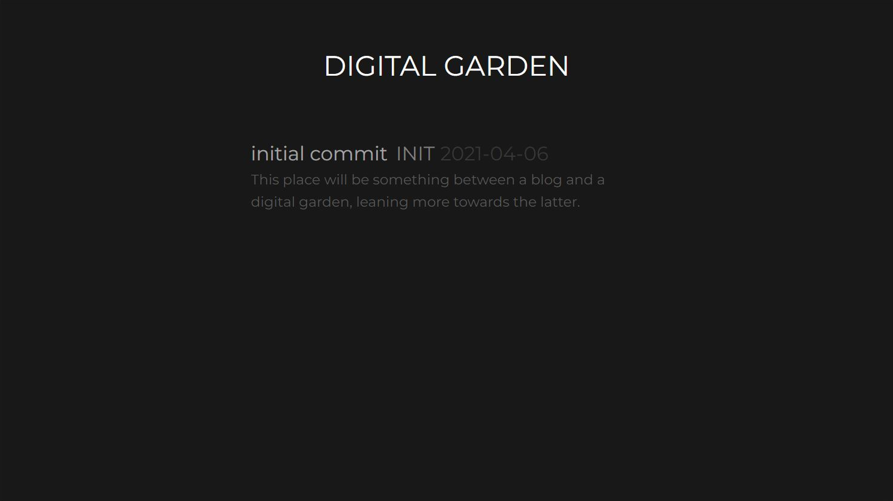
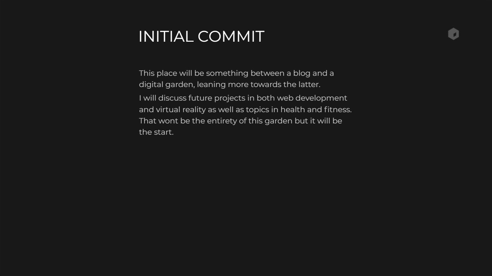

# [digital garden](https://garden.theinept.dev/)

The second iteration of [my digital garden](https://garden.theinept.dev/).

Created to control the site styling while using [Notion](https://www.notion.so/) as the CMS.
# Screenshots

  
  

# Technology

Planned with [Figma](https://www.figma.com/file/ZTw24SPPBpMJmLBS43bU6K/ineptBlog) and developed using [Nuxt.js](https://nuxtjs.org/), splitbee's [notion-api-worker](https://github.com/splitbee/notion-api-worker), and janniks's [vue-notion](https://github.com/janniks/vue-notion) renderer.

